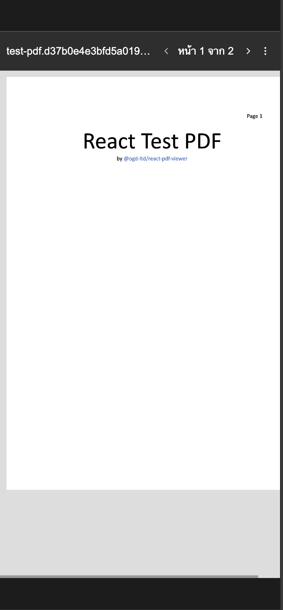

# React PDF Viewer

Easy React PDF Viewer for tablet/phone base on pdf-dist.js.

> \*Componnent computer browser base on iframe


### Install

```bash
npm i @ogs-ltd/react-pdf-viewer
```

### Example
<p align="center">
 

</p>


### Importing

```js
import PDFViewer from "@ogs-ltd/react-pdf-viewer";
import "@ogs-ltd/react-pdf-viewer/dist/style.css";
```

### Usage

```html
<PDFViewer src="{file}" />
```

### Props

| Prop name | Description | Default |
| --------- | ----------- | ------- |
| src | imported using `import … from …` or `"url"` - URL | n/a |

###  Node version requirements
```bash
node: ">18.5.0"
```