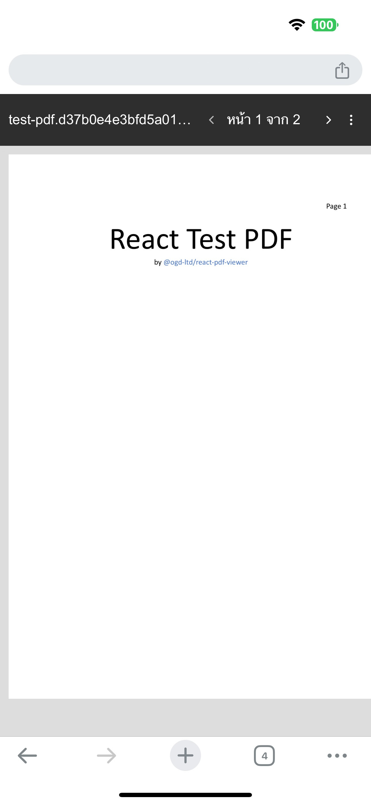
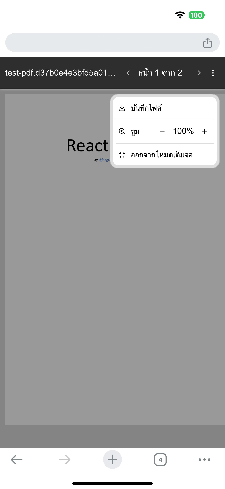

# React PDF Viewer

Easy React PDF Viewer for tablet/phone base on pdf-dist.js.

> \*Componnent computer browser base on iframe


### Install

```bash
npm i @ogs-ltd/react-pdf-viewer
```

### Example
<p align="center">
&nbsp; &nbsp;

</p>


### Importing

```js
import PDFViewer from "@ogs-ltd/react-pdf-viewer";
import "@ogs-ltd/react-pdf-viewer/dist/style.css";
```

### Usage

```html
<PDFViewer src="{file}" />
```

### Props
<style>
r { color: Red }
o { color: Orange }
g { color: Green }
bl { color: Blue }
</style>

| Prop name | Description | Default |
| --------- | ----------- | ------- |
| src <r>*</r> | imported using `import … from …` or `"url"` - URL | n/a |
| pageInfoTextFormat(optional) | <bl>Function</bl> <br/> `(curent: number, totals: number) => string` | ``(curent: number, totals: number) => `หน้า ${curent} จาก ${totals}` `` |
| optionText(optional) | Custom option text by `object` <br/>`{`<br/>`  save: string;`<br/>`  save_loading: string;`<br/>`  zoom: string;`<br/>`  expand: string;`<br/>`  exit_expand: string;`<br/>`}` | `object` <br/>`{`<br/>`  save: "บันทึกไฟล์",`<br/>`  save_loading: "กำลังบันทึกไฟล์",`<br/>`  zoom: "ซูม",`<br/>`  expand: "ขยายเต็มจอ",`<br/>`  exit_expand: "ออกจากโหมดเต็มจอ"`<br/>`}` |

###  Node version requirements
```json
node: ">=18.0.0" 
```